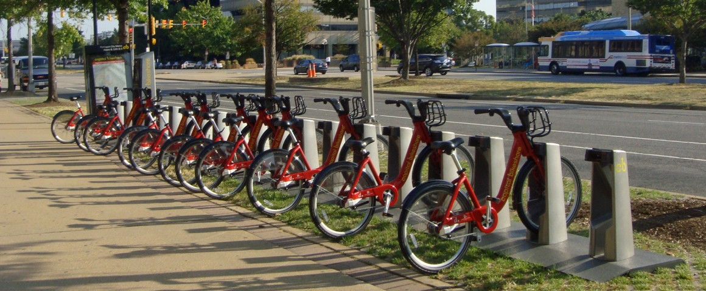

# STA 523 :: Homework 6

## Introduction

Capital Bikeshare is metro DC's bikeshare service. They have a fleet of
4,300 bikes spread out across over 500 stations and 7 jurisdictions around
the DC area. Users checkout a bike at a station and return it to a station
that has a dock opening. Pricing is dependent upon membership level.
The first 30 minutes of each ride are included in the membership or pass price. 
However, a bike can be checked out for longer, but usage fees apply to trips of 
30 minutes or more.

Your primary objective in this assignment is to predict the end docking station
of a user's bike better than everyone else in the course. This is a competition.

## Data

#### Capital Bikeshare

You may only build your model with data from 2013 - 2017 available at the base URL
http://www2.stat.duke.edu/~sms185/data/bike/ with file names cbs_2013.csv,
cbs_2014.csv, cbs_2015.csv, cbs_2016.csv, cbs_2017.csv. You may not use the CSV
files directly available on the Bikeshare website. However, you may use the
data available at https://secure.capitalbikeshare.com/map/.

#### Dark Sky

Supplement the Capital Bikeshare data with weather data from 
[Dark Sky](https://darksky.net/dev). A free account will permit you to make
1,000 API calls per day. How you choose to incorporate this data is up to you
and the model(s) you consider. You must at least consider this data in your
model building process.

#### Other

Other data is allowed, but you must ask the instructor before integrating it
into your assignment and model(s). 

## Tasks

#### Task 1

Obtain and organize the data from the various sources. Do not try to
include these data files in your GitHub repository; they will exceed the 
file size allowed by GitHub.

#### Task 2

Build a model that emits a probability distribution as to a user's bike end
docking station. Your predictions should be output as a CSV file and 
formatted exactly as you see in file cbs_test.csv (access is available by
appending the file name to the base URL stated above).

To evaluate your model, we will use a function of the Brier score, where your
score is defined as

&space;\times&space;100),

and

&space;^&space;2).

You will be able to upload your predictions and see a live leaderboard
[here](https://saxon.stat.duke.edu:3838/sms185/leaderboard_hw6/).
If your score is not displayed, verify that you submitted your
predictions for evaluation in exactly the format specified.

## Rules

1. You may only use the data detailed above and that which has been approved
   by the instructor.

2. Your code must run on Saxon / Trig2 with 4 cores in under 2 hours.

3. There should be no communication about this assignment or code sharing across
   groups.

4. There is no limit on the number of times you may submit predictions to be
   evaluated. However, only your final set of predictions at the deadline will
   be considered for the prize.

5. All probabilities submitted for evaluation must be generated from the data.
   Hard coding is not allowed.

## Expectations

This assignment is very open. There is not a specific model that you must 
produce to obtain an excellent score, nor do you need to win the competition to
earn all 30 points on this assignment. At a minimum you must

- have a well organized Rproject,

- incorporate parallel computing,

- include a Makefile that builds your final HTML document,

- have well documented code,

- provide an explanation of your final model choice,

- include an analysis of your final model,

- include a profile output of your code with a few comments.

## Essential details

#### Deadline and submission

**The deadline to submit Homework 6 is 11:59pm on Thursday, November 14.** 
Only the code in the master branch will be graded.

#### git / GitHub

Each group will have a master branch and other branches with a GitHub name as a prefix.
One will be your GitHub name. You will only be able to push to your branch as 
the master branch is protected. To get your work into branch master 
(the only branch that will be graded), initiate a pull request on GitHub. 
This will then merge your work into the master branch upon approval by one of 
your teammates.

#### Help

- Post your general questions in the #hw6 channel on Slack. Since this is a
  competition, specific questions should be asked in person or direct message
  via Slack.

- Visit the instructor or TAs in office hours.

- The instructor and TAs will not answer any questions within the first 24
  hours of this homework being assigned, and they will not answer questions
  within 6 hours of the deadline.

#### Academic integrity

This is a group assignment. You should not communicate specifics about this
assignment with other groups. As a reminder, any code you use or find as 
inspiration must be cited. Include a references section in your Rmd file if
needed.

>Duke University is a community dedicated to scholarship, leadership, and 
service and to the principles of honesty, fairness, respect, and accountability.
Citizens of this community commit to reflect upon and uphold these principles 
in all academic and non-academic endeavors, and to protect and promote a culture
of integrity. Cheating on exams and quizzes, plagiarism on homework assignments 
and projects, lying about an illness or absence and other forms of academic 
dishonesty are a breach of trust with classmates and faculty, violate the [Duke 
Community Standard](https://gradschool.duke.edu/academics/academic-policies-and-forms/standards-conduct/duke-community-standard),
and will not be tolerated. Such incidences will result in a 
0 grade for all parties involved as well as being reported to the [University 
Judicial Board](https://gradschool.duke.edu/academics/academic-policies-and-forms/standards-conduct/judicial-code-and-procedures). 
Additionally, there may be penalties to your final class grade. 
Please review [Duke's Standards of Conduct](https://gradschool.duke.edu/academics/academic-policies-and-forms/standards-conduct).

#### Grading

**Topic**|**Points**
---------|----------:|
Task 1 |  12
Task 2 |  10
Style, complexity, writing substance and clarity |  8
**Total**|**30**

- *Documents that fail to knit will receive a 0*.
